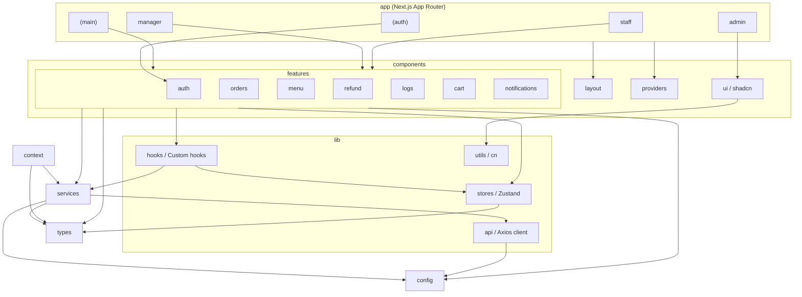

```mermaid
flowchart TD
  subgraph app["app (Next.js App Router)"]
    auth_pages["(auth)"]
    main_pages["(main)"]
    admin_pages[admin]
    manager_pages[manager]
    staff_pages[staff]
  end

  subgraph components["components"]
    ui[ui / shadcn]
    layout[layout]
    subgraph features["features"]
      auth_feat[auth]
      orders_feat[orders]
      menu_feat[menu]
      refund_feat[refund]
      logs_feat[logs]
      cart_feat[cart]
      notifications_feat[notifications]
    end
    providers[providers]
  end

  subgraph lib["lib"]
    api[api / Axios client]
    stores[stores / Zustand]
    hooks[hooks / Custom hooks]
    cn[utils / cn]
  end

  services[services]
  types[types]
  config[config]
  context[context]

  auth_pages --> auth_feat
  main_pages --> features
  admin_pages --> ui
  manager_pages --> features
  staff_pages --> features
  app --> layout
  app --> providers
  features --> services
  features --> hooks
  features --> stores
  features --> types
  features --> config
  ui --> cn
  hooks --> stores
  hooks --> services
  stores --> types
  services --> api
  services --> types
  services --> config
  context --> services
  context --> types
  api --> config
```
